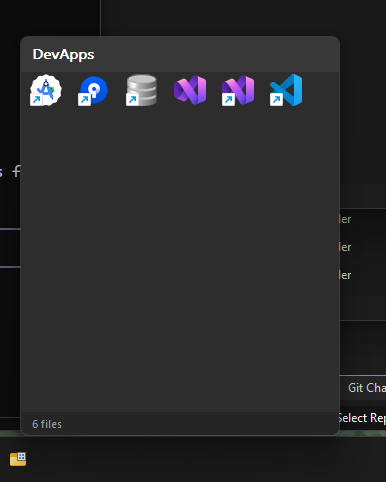
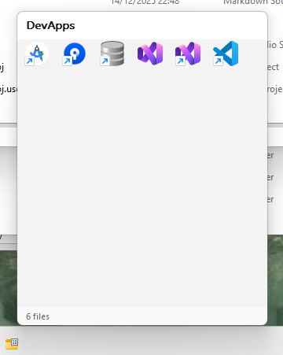

# FolderIcon

A lightweight Windows utility that displays folder contents in a popup window with icons. Perfect for creating custom taskbar launchers.

## Features

- **Clean popup interface** - Displays folder contents as clickable icons
- **Dark/Light mode** - Automatically matches your Windows theme
- **Windows 11 styling** - Rounded corners and modern appearance
- **Single-click launch** - Open files and applications instantly
- **Smart positioning** - Window appears near cursor, respects taskbar location
- **Fade-out animation** - Smooth close animation
- **Tooltips** - Hover over icons to see file names

## Screenshots

| Dark Mode | Light Mode |
|-----------|------------|
|  |  |

## Usage

```cmd
FolderIcon.exe [--folder|-f] <path>
FolderIcon.exe <path>
FolderIcon.exe              # Opens Desktop folder by default
```

## Tutorial: Create a Custom Taskbar Launcher

Transform FolderIcon into a powerful app launcher pinned to your taskbar.

### Step 1: Create a Launcher Folder

Create a folder somewhere on your system to hold your application shortcuts. For example:

```
C:\Users\YourName\MyLauncher
```

### Step 2: Add Application Shortcuts

Inside your launcher folder, add shortcuts to your favorite applications:

1. Navigate to the application you want to add
2. Right-click the `.exe` file and select **Create shortcut**
3. Move the shortcut to your launcher folder
4. Repeat for all applications you want in your launcher

> **Tip:** You can also drag applications from the Start Menu into your launcher folder.

### Step 3: Create a FolderIcon Shortcut

1. Right-click on `FolderIcon.exe` and select **Create shortcut**
2. Move the shortcut to a convenient location (e.g., Desktop)

### Step 4: Configure the Shortcut

1. Right-click on the FolderIcon shortcut and select **Properties**
2. In the **Target** field, add your launcher folder path as an argument:

   ```
   "C:\Path\To\FolderIcon.exe" "C:\Users\YourName\MyLauncher"
   ```

3. (Optional) Click **Change Icon...** to customize the shortcut icon
4. Click **OK** to save

### Step 5: Pin to Taskbar

1. Drag the configured FolderIcon shortcut to your taskbar
2. Drop it where you want it to appear

### Step 6: Use Your Launcher

1. **Left-click** the taskbar icon to open the launcher popup
2. **Single-click** any icon to launch that application
3. The popup closes automatically after launching
4. Click outside the popup or press **Escape** to close without launching

### Tips

- **Organize by category:** Create multiple launcher folders (Games, Dev Tools, Office) with separate taskbar shortcuts
- **Use descriptive names:** Rename shortcuts in your launcher folder for clearer tooltips
- **Add folders:** You can include folder shortcuts to quickly access directories
- **Drag the header:** Click and drag the header bar to reposition the popup window
- **Double-click header:** Opens the launcher folder itself in Explorer

## Building from Source

### Prerequisites

- Windows 10/11 (x64)
- Visual Studio 2019+ with "Desktop development with C++" workload
- Windows SDK 10.0+

### Build with Visual Studio

```cmd
msbuild FolderIcon.sln /p:Configuration=Release /p:Platform=x64
```

### Build with CMake

```cmd
mkdir build && cd build
cmake ..
cmake --build . --config Release
```

### Output Locations

| Configuration | Output Path |
|--------------|-------------|
| Debug | `bin\Debug\FolderIcon.exe` |
| Release | `bin\Release\FolderIcon.exe` |

## Technical Details

- Written in pure C (C17)
- No external dependencies beyond Windows SDK
- Single-file implementation (~550 lines)
- Uses Win32 API directly (no MFC/ATL/WTL)

## License

MIT License - See [LICENSE](LICENSE) for details.
